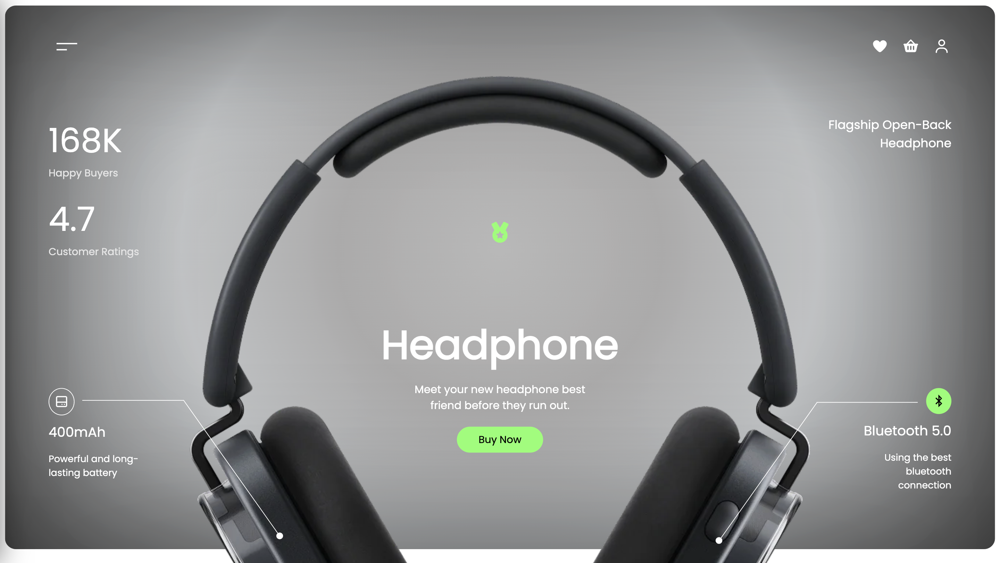

# My Portfolio Website

A responsive personal portfolio website built with HTML, CSS, and JavaScript. This project showcases my skills in frontend development and clean UI design.

---

## Live Demo

Visit the live site here: [My Website](https://headphone-rgb.netlify.app/)

---

## Features

- Responsive design (mobile and desktop friendly)
- Contact form with validation
- Smooth scroll and section animations
- Modular and clean code structure

---

## Technologies Used

- HTML5
- CSS3 (Flexbox, Grid)
- JavaScript

## Inspired

This design was inspired by [Emily Johansson](https://dribbble.com/emilyjohansson) from Dribble:
- [Visit](https://dribbble.com/shots/26440711-Headphone-E-Commerce-Landing-Page)
